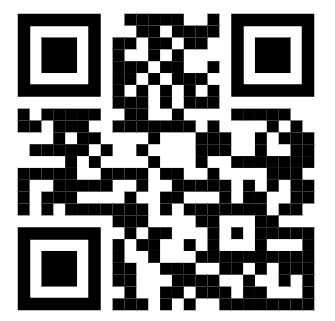

# 🍄 Mushroom App 🍄

## ROADMAP

- ✅ Navigate to specified id using react navigation linking
- ✅ Open the app using specified deep linking with iOS native camera
  (e.g. `mushroom://`). Take a look to: `src/navigation/routes.ts`
- ✅ Add QR scanning and try to scan a generated QR with the deep link inside and navigate to it.

  
